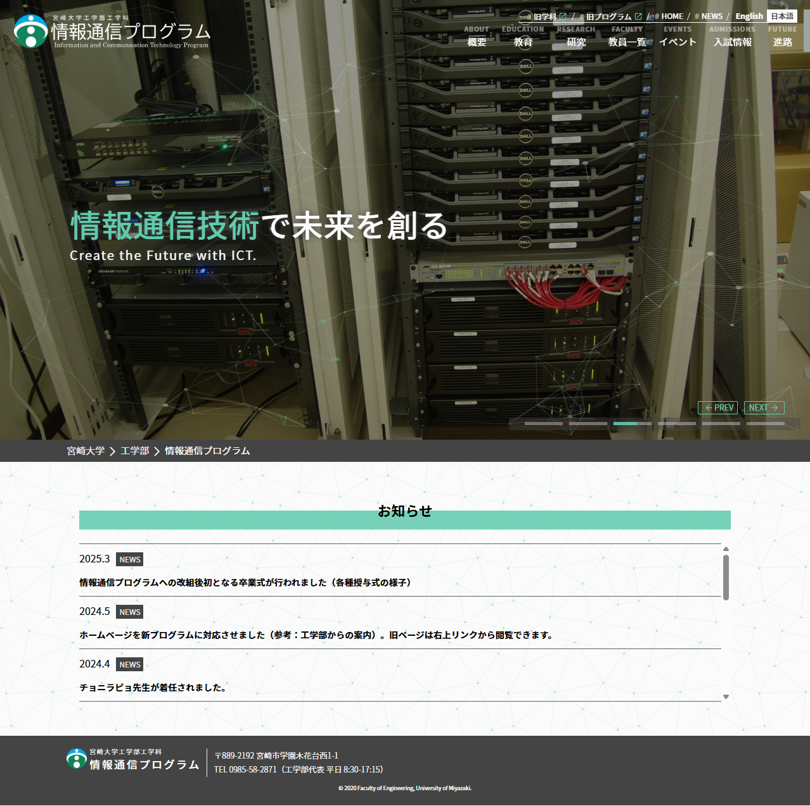

## Hi there 👋

Works:
- HP制作：[宮崎大学工学部工学科 情報通信工学プログラム (旧ホームページ)](https://www.miyazaki-u.ac.jp/ict/)

- wip
  

<!--
**Name** : 山口 聡太郎 (Sotaro YAMAGUCHI)

-->

<!--
**sotaro-ac/sotaro-ac** is a ✨ _special_ ✨ repository because its `README.md` (this file) appears on your GitHub profile.

Here are some ideas to get you started:

- 🔭 I’m currently working on ...
- 🌱 I’m currently learning ...
- 👯 I’m looking to collaborate on ...
- 🤔 I’m looking for help with ...
- 💬 Ask me about ...
- 📫 How to reach me: ...
- 😄 Pronouns: ...
- ⚡ Fun fact: ...
-->
